<div align="center">

<h1 style="font-size: 18px; margin-bottom: 5px; border: none;">
LAPORAN PRAKTIKUM <br>
PEMROGRAMAN BERBASIS WEB
</h1>

<p font-size: 12px; color: #555;">
<i>"Laporan ini disusun guna memenuhi penilaian dalam mata kuliah Prak. PBW"</i>
</p>

<br>


<br><br>

<p style="font-size: 14px; margin-bottom: 5px;">
<b>Disusun Oleh:</b>
</p>

<p style="font-size: 15px; margin-top: 5px;">
<b>Nadine Agietha Bethesda</b><br>
4524210073
</p>

<br>

<p style="font-size: 14px; margin-bottom: 5px;">
<b>Dosen:</b>
</p>

<p style="font-size: 14px; margin-top: 5px;">
Ari Wibowo, S.Kom., M.Kom., C. Pro
</p>

<br><br><br>

<h3 style="font-size: 16px; margin-bottom: 5px; border: none;">
S1-TEKNIK INFORMATIKA <br>
FAKULTAS TEKNIK UNIVERSITAS PANCASILA <br>
<b>2026/2027</b> 
</h3>

</div>

---

## 1. Jalankan seluruh contoh pertemuan 3 hingga 4 menghasilkan output tanpa error kritis

### Tabel Hasil

<table>
  <tr>
    <th>No</th>
    <th>Query</th>
    <th>Output</th>
  </tr>
  <tr>
    <td>1</td>
    <td>
      <pre><code>CREATE DATABASE akademik 
CHARACTER SET utf8mb4 
COLLATE utf8mb4_unicode_ci;
USE akademik;</code></pre>
    </td>
    <td>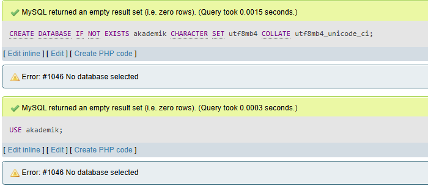</td>
  </tr>
  <tr>
    <td>2</td>
    <td>
      <pre><code>CREATE TABLE mahasiswa (
  id INT AUTO_INCREMENT PRIMARY KEY,
  nim VARCHAR(15),
  nama VARCHAR(100),
  tanggal_lahir DATE,
  ipk DECIMAL(3,2) CHECK (ipk BETWEEN 0.00 AND 4.00)
);</code></pre>
    </td>
    <td>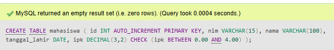</td>
  </tr>
  <tr>
    <td>3</td>
    <td>
      <pre><code>CREATE TABLE prodi (
  id_prodi INT AUTO_INCREMENT PRIMARY KEY,
  nama_prodi VARCHAR(100)
);</code></pre>
    </td>
    <td>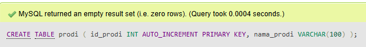</td>
  </tr>
  <tr>
    <td>4</td>
    <td>
      <pre><code>ALTER TABLE mahasiswa ADD COLUMN id_prodi INT;

ALTER TABLE mahasiswa 
ADD CONSTRAINT fk_mahasiswa_prodi 
FOREIGN KEY (id_prodi) REFERENCES prodi(id_prodi);</code></pre>
    </td>
    <td>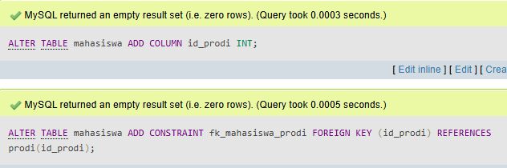</td>
  </tr>
  <tr>
    <td>5</td>
    <td>
      <pre><code>INSERT INTO mahasiswa (nim, nama, tanggal_lahir, ipk, id_prodi) 
VALUES ('24210073', 'Nadine Agietha', '2006-05-03', 4.50, 1);</code></pre>
    </td>
    <td>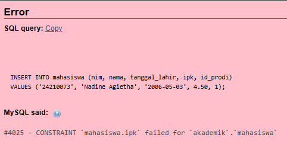</td>
  </tr>
  <tr>
    <td>6</td>
    <td>
      <pre><code>INSERT INTO prodi (nama_prodi) VALUES 
('Teknik Informatika'), 
('Sistem Informasi'), 
('Teknik Elektro');</code></pre>
    </td>
    <td>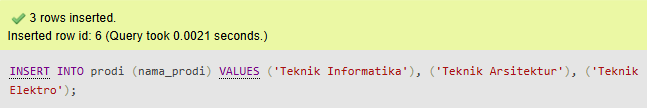</td>
  </tr>
  <tr>
    <td>7</td>
    <td>
      <pre><code>INSERT INTO mahasiswa (nim, nama, tanggal_lahir, ipk, id_prodi) 
VALUES ('24210073', 'Nadine Agietha', '2006-05-03', 3.93, 1);</code></pre>
    </td>
    <td>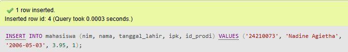</td>
  </tr>
  <tr>
    <td>8</td>
    <td>
      <pre><code>INSERT INTO mahasiswa (nim, nama, tanggal_lahir, ipk, id_prodi) VALUES 
('24210028', 'Dina Camelia', '2003-08-20', 3.20, 1),
('24210073', 'Nadine Agietha', '2006-05-03', 3.97, 2),
('24210075', 'Nailah AlyaCalista', '2003-03-10', 3.65, 3);</code></pre>
    </td>
    <td>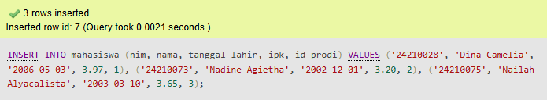</td>
  </tr>
</table>

---

### Latihan A

<table>
  <tr>
    <th>No</th>
    <th>Query</th>
    <th>Output</th>
  </tr>
  <tr>
    <td>9</td>
    <td>
      <pre><code>CREATE TABLE mahasiswa (
  nim VARCHAR(15) PRIMARY KEY,
  nama VARCHAR(100) NOT NULL,
  email VARCHAR(120) NOT NULL UNIQUE,
  prodi VARCHAR(80) NOT NULL,
  angkatan YEAR NOT NULL,
  ipk DECIMAL(3,2) DEFAULT 0.00,
  CHECK (ipk BETWEEN 0.00 AND 4.00)
) ENGINE=InnoDB;

CREATE TABLE dosen (
  nidn VARCHAR(20) PRIMARY KEY,
  nama VARCHAR(100) NOT NULL,
  email VARCHAR(120) UNIQUE
) ENGINE=InnoDB;

CREATE TABLE mata_kuliah (
  kode_mk VARCHAR(12) PRIMARY KEY,
  nama_mk VARCHAR(100) NOT NULL,
  sks TINYINT UNSIGNED NOT NULL,
  nidn VARCHAR(20),
  CONSTRAINT fk_mk_dosen FOREIGN KEY (nidn) REFERENCES dosen(nidn)
    ON UPDATE CASCADE
    ON DELETE SET NULL
) ENGINE=InnoDB;</code></pre>
    </td>
    <td>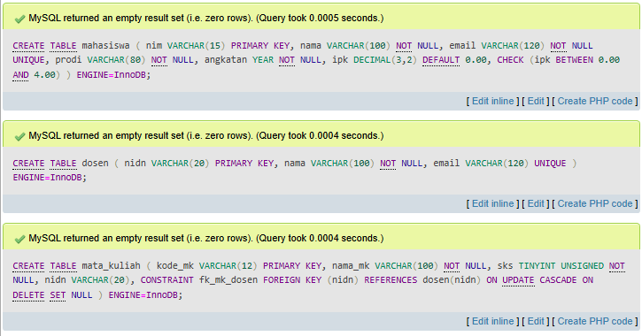</td>
  </tr>
</table>

---

### Latihan B

<table>
  <tr>
    <th>No</th>
    <th>Query</th>
    <th>Output</th>
  </tr>
  <tr>
    <td>10</td>
    <td>
      <pre><code>CREATE TABLE krs (
  id BIGINT UNSIGNED AUTO_INCREMENT PRIMARY KEY,
  nim VARCHAR(15) NOT NULL,
  kode_mk VARCHAR(12) NOT NULL,
  semester TINYINT UNSIGNED NOT NULL,
  tahun_ajaran VARCHAR(9) NOT NULL,
  nilai_huruf CHAR(2) NULL,
  CONSTRAINT uq_krs UNIQUE (nim, kode_mk, semester, tahun_ajaran),
  CONSTRAINT fk_krs_mahasiswa FOREIGN KEY (nim) REFERENCES mahasiswa(nim)
    ON UPDATE CASCADE
    ON DELETE CASCADE,
  CONSTRAINT fk_krs_mk FOREIGN KEY (kode_mk) REFERENCES mata_kuliah(kode_mk)
    ON UPDATE CASCADE
    ON DELETE RESTRICT
) ENGINE=InnoDB;</code></pre>
    </td>
    <td>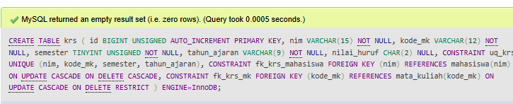</td>
  </tr>
</table>

---

## 2. Buat modifikasi bermakna pada program
**Query:**
```sql
ALTER TABLE mahasiswa 
ADD COLUMN no_hp VARCHAR(15),
ADD COLUMN status ENUM('Aktif','Cuti','Lulus') DEFAULT 'Aktif',
ADD CONSTRAINT cek_angkatan CHECK (angkatan BETWEEN 2021 AND 2025);
```
**Perbandingan sebelum & sesudah modifikasi:**

<table>
  <tr>
    <th>Sebelum Modifikasi</th>
    <th>Sesudah Modifikasi</th>
  </tr>
  <tr>
    <td>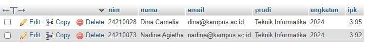</td>
    <td>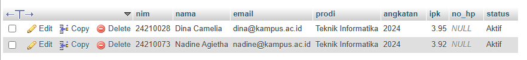 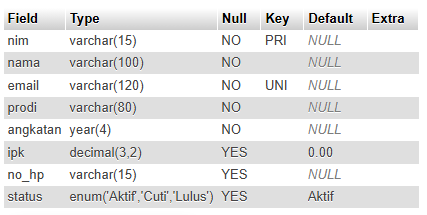 </td>
</td>
  </tr>
</table>

## 3. Tuliskan penjelasan singkat untuk 5 kode penting
### 1. CREATE DATABASE untuk penyimpanan semua table
```sql
CREATE DATABASE akademik 
CHARACTER SET utf8mb4 
COLLATE utf8mb4_unicode_ci;
```

### 2. PRIMARY KEY untuk memastikan setiap baris data punya identitas unik dan mencegah duplikasi data mahasiswa
```sql
nim VARCHAR(15) PRIMARY KEY
```

### 3. FOREIGN KEY untuk membangun rekasi antar tabel dan memastikan data di tabel di anak (krs) ke data valid di tabel induk (mahasiswa)
```sql
CONSTRAINT fk_krs_mahasiswa 
FOREIGN KEY (nim) REFERENCES mahasiswa(nim)
```

### 4. CHECK Constraint untuk memvalidasi data secara otomatis dan mencegah input ipk di luar rentang 0.00-4.00
```sql
CHECK (ipk BETWEEN 0.00 AND 4.00)
```

### 5. ENGINE=InnoDB, untuk mendukung foreign kay dan transaksi bertipe engine. Tanpa InnoDB, relasi antar tabel tidak jalan
```sql
) ENGINE=InnoDB;
```

## 4. Screenshot sebelum dan sesudah modifikasi

<!-- ISI DI SINI -->

---

## 5. Tuliskan satu error yang pernah muncul, penyebab, dan langkah perbaikan

<!-- ISI DI SINI -->
