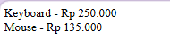
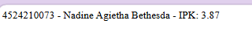
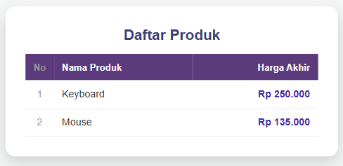
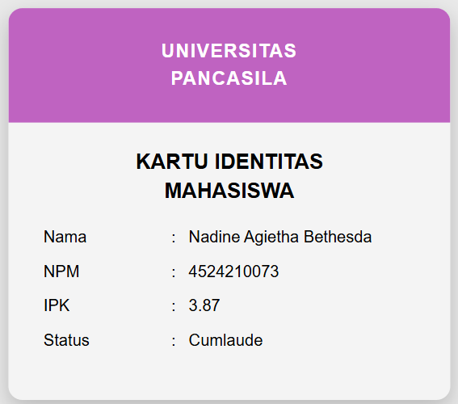

<div align="center">

<h1 style="font-size: 18px; margin-bottom: 5px; border: none;">
LAPORAN PRAKTIKUM <br>
PEMROGRAMAN BERBASIS WEB
</h1>

<p font-size: 12px; color: #555;">
<i>"Laporan ini disusun guna memenuhi penilaian dalam mata kuliah Prak. PBW"</i>
</p>

<br>


<br><br>

<p style="font-size: 14px; margin-bottom: 5px;">
<b>Disusun Oleh:</b>
</p>

<p style="font-size: 15px; margin-top: 5px;">
<b>Nadine Agietha Bethesda</b><br>
4524210073
</p>

<br>

<p style="font-size: 14px; margin-bottom: 5px;">
<b>Dosen:</b>
</p>

<p style="font-size: 14px; margin-top: 5px;">
Ari Wibowo, S.Kom., M.Kom., C. Pro
</p>

<br><br><br>

<h3 style="font-size: 16px; margin-bottom: 5px; border: none;">
S1-TEKNIK INFORMATIKA <br>
FAKULTAS TEKNIK UNIVERSITAS PANCASILA <br>
<b>2026/2027</b> 
</h3>

</div>

## TUGAS 2
## 1. Jalankan seluruh contoh pertemuan 1 hingga menghasilkan output tanpa error kritis
- **`hitung.php`**


- **`identitas.php`**


## 2. Buat minimal dua modifkasi bermakna pada program
### 1.) Menambahkan Method `infoProduk()` supaya setiap produk punya keterangan sendiri (harga normal atau diskon) karena didefinisikan di intercare jadi wajib menggunakan method ini.
Code di interface:
```php
interface BisaDihitung
{
    public function hargaAkhir(): float;
    public function infoProduk(): string;
}
```
Code di class 'Produk':
```php
public function infoProduk(): string
{
    return $this->nama . " (Harga Normal)";
}
```

Code di class `ProdukDiskon`:
```php
public function infoProduk(): string
{
    return $this->nama . " (Diskon {$this->diskon}%)";
}
```

### 2.) Constructor `Produk` digunakan untuk mencegah harga bernilai negatif masuk ke object. Jika dilanggar, program melempar `InvalidArgumentException`.
Code:
```php
public function __construct(
    protected string $nama,
    protected float $harga
) {
    if ($harga < 0) {
        throw new InvalidArgumentException("Harga tidak boleh negatif!");
    }
}
```


## 3. Tuliskan penjelasan singkat untuk 5 kode penting
## 1.) Interface `BisaDihitung` digunakan untuk memastikan setiap class wajib ounya method 'hargaAkhir()' dan 'infoProduk(); untuk menjaga struktur antar class.
Code:
```php
interface BisaDihitung
{
    public function hargaAkhir(): float;
    public function infoProduk(): string;
}
```

### 2.) Constructor adalah method yang digunakan untuk otomatis memanggil saat object dibuat. Fungsinya adalah mengisi property `nama` dan `harga` saat object dibuat, sekaligus memvalidasi agar `$harga` tidak bernilai negatif.
Code:
```php
public function __construct(
    protected string $nama,
    protected float $harga
) {
    if ($harga < 0) {
        throw new InvalidArgumentException("Harga tidak boleh negatif!");
    }
}
```

### 3.) Inheritance — `ProdukDiskon extends Produk` digunakan untuk mewarisi semua yang dimiliki `Produk`, tapi meng-*override* method `hargaAkhir()` agar menghitung diskon. `parent::__construct()` memanggil constructor induk.
Code: 
```php
class ProdukDiskon extends Produk
{
    public function __construct(string $nama, float $harga, private float $diskon)
    {
        parent::__construct($nama, $harga);
    }

    public function hargaAkhir(): float
    {
        return $this->harga * (1 - $this->diskon / 100);
    }
}
```
### 4.) Encapsulation di `identitas.php` sebagai private` yang hanya bisa diakses dari dalam class, `protected` bisa diakses dari class anak. Setter `setIpk()` memvalidasi nilai IPK sebelum disimpan.
Code:
```php
class Mahasiswa implements Identitas
{
    private string $nim;
    private string $nama;
    protected float $ipk;

    public function setIpk(float $ipk): void
    {
        if ($ipk < 0 || $ipk > 4) {
            throw new InvalidArgumentException('IPK harus 0 sampai 4.');
        }
        $this->ipk = $ipk;
    }
}
```
### 5.) Polymorphism bersifat tergantung perbedaan objectnya, walaupun `$daftar` berisi 2 object berbeda (`Produk` dan `ProdukDiskon`), PHP otomatis memanggil `hargaAkhir()` yang sesuai class masing-masing.
Code:
```php
$daftar = [
    new Produk('Keyboard', 250000),
    new ProdukDiskon('Mouse', 150000, 10)
];

foreach ($daftar as $produk) {
    echo $produk->getNama() . ' - Rp ' . number_format($produk->hargaAkhir(), 0, ',', '.') . "<br>";
}
```

## 4. Screenshot sebelum dan sesudah modifkasi
## a. hitung.php
**Sebelum:**


**Sesudah:**


## b.identitas.php
**Sebelum:**


**Sesudah:**


## 5. Tuliskan satu error yang pernah muncul, penyebab, dan langkah perbaikan
| Item | Keterangan |
|------|------------|
| **Error** | `Uncaught InvalidArgumentException: Harga tidak boleh negatif!` |
| **Penyebab** | Saat membuat object `new Produk('Produk Rusak', -5000)`, nilai `$harga` bernilai negatif. Validasi di constructor melempar exception, tapi tidak ada `try-catch` untuk menangkap. |
| **Perbaikan** | Bungkus pembuatan object dalam blok `try { ... } catch (InvalidArgumentException $e) { ... }` agar program tidak crash. |
